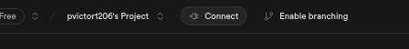
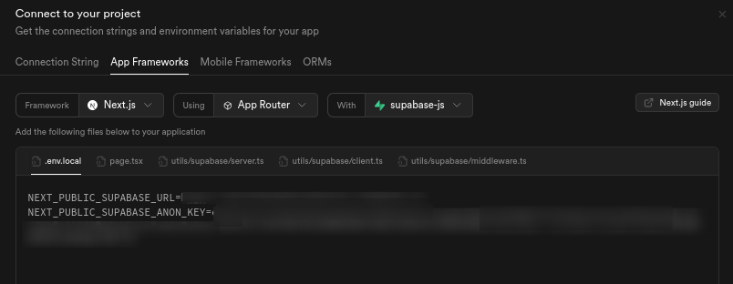
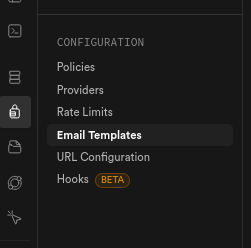
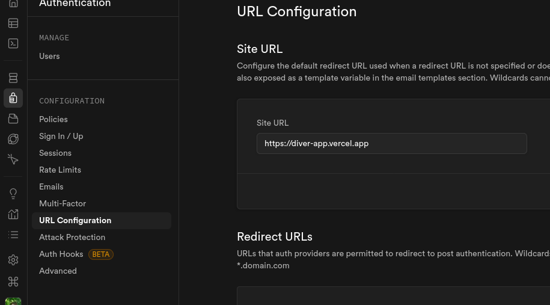

# Cog Tec


<!--toc:start-->

- [Cog Tec](#cog-tec)
  - [Sobre](#sobre)
  - [Mockups](#mockups)
  - [Nossa Equipe](#nossa-equipe)
  - [Tecnologias](#tecnologias)
  - [Desenvolvimento Local](#desenvolvimento-local)
    - [Repositório](#repositório)
      - [Clonar uma branch específica](#clonar-uma-branch-específica)
    - [Variáveis de ambiente](#variáveis-de-ambiente)
      - [Como utilizar suas próprias chaves secretas](#como-utilizar-suas-próprias-chaves-secretas)
      - [Atualizando templates de email](#atualizando-templates-de-email)
      - [Configurando tabelas](#configurando-tabelas)
      - [Configurando o domínio](#configurando-o-domínio)
    - [Instalando pacotes](#instalando-pacotes)
      - [Intalando Yarn](#intalando-yarn)
    - [Desenvolvendo](#desenvolvendo)
  - [Requisitos Funcionais e Não-Funcionais](#requisitos-funcionais-e-não-funcionais)
  <!--toc:end-->

## Sobre

Nosso projeto tem a intenção de ajudar alunos que estão estudando os conceitos de
Teoria Sociocultural e estejam com dificuldades na cadeira de Cognição e suas
Tecnologias Digitais. A plataforma funcionará como uma atividade interativa e
gamificada, trazendo um conteúdo mais fácil e rápido de digerir aos poucos.

## Mockups

[Figma: Protótipo de Alta Fidelidade](https://www.figma.com/design/PVYWWWByYfwvGellKENMYo/Prot%C3%B3tipos-de-m%C3%A9dia-v2)

## Nossa Equipe

| nome              | função           |
| :---------------- | :--------------- |
| Shyanne           | Líder de Projeto |
| Pedro Henrique    | UI Designer      |
| Yves Klavdian     | UI Designer      |
| Kodie Freitas     | Frontend Dev     |
| Antonio Guilherme | Frontend Dev     |
| Maria Eduarda     | Fullstack Dev    |
| Paulo Magalhães   | Backend Dev      |

## Tecnologias

- Node.js
- Next.js
- Typescript
- Supabase
- Tailwindcss

## Desenvolvimento Local

Tenha certeza de ter o [Node.js](https://nodejs.org/en/download) instalado.

### Repositório

Clone esse repositório localmente (ou cire seu ppróprio fork):

```bash
git clone https://github.com/DIVER-study/diver-app.git
```

> OBS: A branch mais atualizada do repositório é a [dev](https://github.com/DIVER-study/diver-app/tree/dev).
> Porém a [main](https://github.com/DIVER-study/diver-app/tree/main) terá sempre a versão mais estável do projeto.
> e será sempre a versão de produção, ou seja a versão que está no link [diver-app](https://diver-app.vercel.app)
> O desenvolvimento dos requerimentos são feitos em branchs separadas

<details>
<summary>Clonando uma braanch específica</summary>

#### Clonar uma branch específica

Você pode clonar uma branch específica com esse comando:

```bash
# git clone https://github.com/DIVER-study/diver-app.git -b <nome-da-branch>
git clone https://github.com/DIVER-study/diver-app.git -b dev
```

</details>

### Variáveis de ambiente

Na pasta do projeto, crie um arquivo com nome: `.env.local`

> Recomendado que tenha ativada as opções 'mostrar arquivos ocultos' e
> 'mostar extensões de arquivos' do explorer

Dentro do `.env.local` coloque:

```dotenv
NEXT_PUBLIC_SUPABASE_URL=<url-publico-do-projeto-no-supabase>
NEXT_PUBLIC_SUPABASE_ANON_KEY=<chave-anonima-do-supabase>
```

> Pegue as chaves secretas com um dos devs, ou no seu próprio projeto no supabase, e coloque elas nos lugares adequados.

<details>
<summary>Criando seu próprio projeto no Supabase</summary>

#### Como utilizar suas próprias chaves secretas

No site do [Supabase](https://supabase.com), faça ou entre em uma conta e crie um novo projeto.
Preencha todos os detalhes que o supabase pedir.

Com um novo projeto criado, na barra de naavegação clique em connect:


Um novo popup aparecerar com novas opções.
Procure por App Frameworks, selecione as opções de NextJS e SupabaseJS
e suas chaves secretas estrão disponíveis.


#### Atualizando templates de email

Supabase utiliza templates de email para enviar links
para os usuários confirmarem seu email ou redefinir sua senha.

Para que possa fazer isso no seu próprio projeto do Supabase,
utilize os templetes encontrados para:

- Confirmação de email [confirmation.html](/supabase/templates/confirmation.html)
- Redefinição de senha [recovery.html](/supabase/templates/recovery.html)

Copie o html desses arquivos e cole eles nos templates adequados

você pode encontrar os templates aqui:



#### Configurando tabelas

Nossas tabelas, funções, triggers, políticas e buckets podem ser criadas com o seguinte SQL:

veja o arquivo: [init_project.sql](./init_project.sql)
você pode copiar o código do arquivo no editor de sql do Supabase

#### Configurando o domínio

Para que o Supabase possa interagir com a aplicação,
você deve indicar a ele qual o domínio da sua aplicação.
O domínio usado no processo de desenvolvimento é <https://localhost:3000>,
caso já tenha um domínio próprio de produção, utilize-o.

você pode encontrar as configurações de url na seção de autenticação:



</details>

### Instalando pacotes

Em seguida instale os pacotes do projeto:

```bash
yarn install
```

<details>
<summary>Como instalar o Yarn</summary>

#### Intalando Yarn

Instale o yarn com o npm ou com sua distribuição linux

```bash
npm i -g yarn
```

Ative o corepack como admin

```bash
sudo corepack enable
# no windows, abra o prompt de comando como admin
# corepack enable
```

E dentro da pasta de projeto atualize o yarn
e instale os pacotes

```bash
yarn set version berry
yarn install
```

</details>

### Desenvolvendo

Nosso projeto utiliza [Next.js](https://nextjs.org) e foi inicializado com [`create-next-app`](https://nextjs.org/docs/app/api-reference/cli/create-next-app).

Agora, inicialize o servidor de desenvolvimento:

```bash
yarn dev
```

Abra [http://localhost:3000](http://localhost:3000) no seu navegador e veja o resultado.

Você pode editar as páginas na pasta `app/`. As páginas atulizam conforme as edita.

## Requisitos Funcionais e Não-Funcionais

Acesse a tabela nesse link: [Tabela de Requisitos](https://docs.google.com/spreadsheets/d/1WzkAcBs6IBwXHklCpwbMeGyta-0hUh-rsLZbWoxZaFc/edit?usp=sharing)
